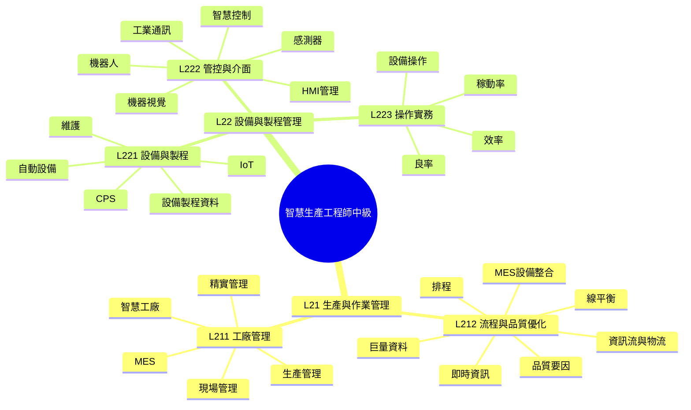

# 中級考綱知識圖

```mermaid
mindmap
  root((智慧生產工程師中級))
    L21 生產與作業管理
      L211 工廠管理
        生產管理
        精實管理
        智慧工廠
        現場管理
        MES
      L212 流程與品質優化
        資訊流與物流
        MES設備整合
        巨量資料
        排程
        線平衡
        品質要因
        即時資訊
    L22 設備與製程管理
      L221 設備與製程
        IoT
        CPS
        自動設備
        維護
        設備製程資料
      L222 管控與介面
        感測器
        機器視覺
        機器人
        工業通訊
        智慧控制
        HMI管理
      L223 操作實務
        設備操作
        稼動率
        良率
        效率
```

