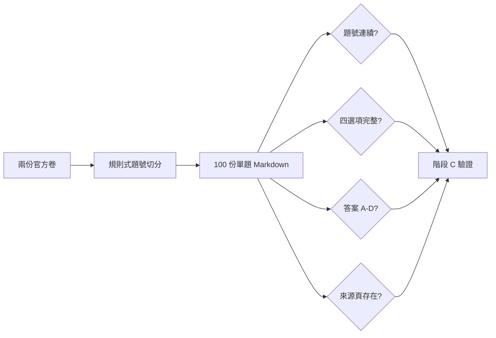

# 階段 C：結構化題庫驗證

| 科目 | 題數 | 題號 1–50 | 四選項完整 | 答案有效 | 頁碼完整 |
|---|---:|:---:|:---:|:---:|:---:|
| L21 | 50 | PASS | PASS | PASS | PASS |
| L22 | 50 | PASS | PASS | PASS | PASS |

**階段結果：PASS**

```mermaid
flowchart LR
    A[兩份官方卷] --> B[規則式題號切分]
    B --> C[100 份單題 Markdown]
    C --> D{題號連續?}
    C --> E{四選項完整?}
    C --> F{答案 A-D?}
    C --> G{來源頁存在?}
    D --> H[階段 C 驗證]
    E --> H
    F --> H
    G --> H
```
